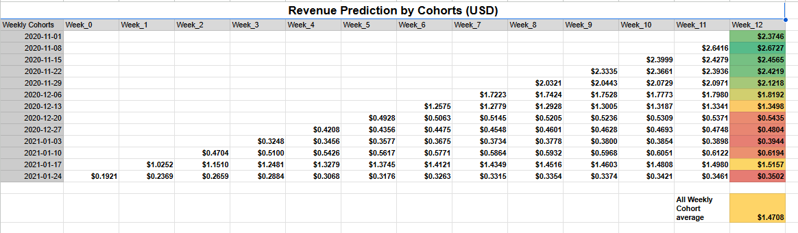

# Customer Lifetime Value Analysis

I assume to be a data analyst working in an e-commerce shop. This e-commerce shop is quite new and previously relied on 3rd party tools to analyze user behavior. 

As it grew, this was not enough and they need me to help them understand business better. Particularly they are interested if their marketing spending is justifiable. They know that it costs them **2 US$** on average to acquire a new customer on their website.

# E-Commerce Dataset:
The available data is a single parsed events table which contains various frontend actions done on the E-Commerce website. Table is called `raw_events` and columns description are available in the table details section. 

The database is in BigQuery and my queries are written in bigquery.

Data in the table contains records from 2020-11-01 until 2021-01-31.

# Main Task:
I got my main task from the manager as he read some article that calculating CLV using Shopify’s formula is too simplistic. He has heard somewhere that using cohorts produces more reliable and actionable results. He therefore requested that I made adjustments to the previously done analysis.
Here is the task summary from the manager:

_Please use the raw_events table to answer follow up questions:_

_TIP: imagine that current week is 2021-01-24 (the last weekly cohort you have in your dataset)._

Additionally, we identified 2 problems with our previous analysis:

1. _The previous analysis included only customers who purchased something, while marketing is counting all user registrations that they manage to bring to the ecommerce site. Pls, adjust your calculations to include all users who have been on our website, not only the one who purchased something._
2. _The average customer does not tend to stay with the ecommerce site for too long. We want to see weekly picture using cohorts. We expect customers to stay no longer than 12 weeks with our ecommerce site._

# My Thought Process:
* As the first step, I wrote a [query](ClvQueries.sql) to pull data of weekly revenue divided by registrations. Since in this particular site there is no concept of registration, we will simply use the first visit to the website as registration date (registration cohort).
* I used `user_pseudo_id` to distinguish between users.
* Then divide revenue in consequent weeks by the number of weekly registration numbers.
* I then applied conditional formatting.
* The resulting table is **Weekly Average Revenue** as shown below.
* **_[Googlesheet CLV](https://docs.google.com/spreadsheets/d/1gJ4HS8z3sdNAtHL8-GleoRmNuKeb0-zl3OiOAmKf3Cs/edit?gid=502478635#gid=502478635) has the cohort charts._**

## Weekly Average Revenue:

### Insights:									
**Decreasing Revenue Over Time:**						
1. There is a noticeable trend where the weekly average revenue decreases as we move from Week 0 to subsequent weeks. 
2. This suggests that user engagement and spending tend to decline over time after users register. 
3. Efforts to retain user interest or re-engage them might be necessary to sustain revenue."									
									
**Higher Initial Revenue in Earlier Cohorts:**									
Earlier cohorts (e.g., November 2020 registrations) show higher initial revenue compared to later cohorts (e.g., January 2021 registrations). 
This might indicate changes in user acquisition quality, marketing efforts, or seasonal effects influencing user behavior.						

Next, I produce the same chart, but the revenue / registrations for a particular week cohort was expressed as a cumulative sum. For this I simply added previous week revenue to current week’s revenue..
The result is :

## Cumulative Revenue by Cohorts (USD):

* Basically, this chart above shows growth of revenue by registered users in cohort for n weeks after registration. 
* While numbers below summarize those values in monetary terms and percentage terms. 
* This provides a coherent view of how much revenue you can expect to grow based on the available  historical data.

## Revenue Prediction by Cohorts (USD):
- Next, I focused on the future and tried to predict the missing data. 
- Missing data in this case is the revenue we should expect from later acquired user cohorts. 
- For example, for users whose first session happened on 2021-01-24 week we have only their first week revenue which is `0.19$` per user who started their first session in this week. Though we are not sure what will happen in the next 12 weeks.
- For this, I simply used previously calculated Cumulative growth % to predict all 12 future weeks values (ex. for this cohort we can calculate expected revenue for week 1 as 0.19 USD x (1 + 23.29%) = 0.24 USD, for week 2 as 0.24 USD x (1 + 12.26%) = 0.27 USD). 
- Using `Avg. cumulative growth` for each week, we can calculate that based on 0.19$ initial value, we can expect 0.35 USD as revenue on week 12. I have therefore provided a chart which calculates these numbers for all future weeks (up till week 12). As seen below:

### Insights:																								
**Relevance of the "All Weekly Cohort Average:**															
1. The $1.47 average serves as a benchmark for evaluating the relative performance of each cohort. 
2. Cohorts exceeding this average are considered more successful in generating revenue, while those falling below it may indicate opportunities for improvement in retention strategies or customer engagement.						
															
**Cohorts Above Average:**															
1. The cohorts starting on Nov 8, Nov 15, and Nov 22 exceed this average significantly, with Week 12 CLV predictions of $2.67, $2.46, and $2.37, respectively. 
2. This indicates that these cohorts are performing much better in terms of cumulative revenue and customer lifetime value.												
															
**Cohorts Below Average:**														
1. The January 2021 cohorts, for instance, have Week 12 predictions that are well below the $1.47 average. 
2. The lowest among them is $0.35, suggesting weaker performance for customers acquired during that time frame.

## Recommendations Based on CLV Predictions:											
											
1. **Invest More in High-Performing Cohorts (Nov - Dec 2020):**											
  The cohorts from Nov 8, Nov 15, and Nov 22, 2020, show high predicted CLV values (above $2.30). 
  It indicates that customers acquired during this period are more valuable."											
**Recommendation:** Increase marketing spend on channels or strategies used during these weeks, as they seem to attract higher-value customers. 
                     Analyze what might have contributed to the higher CLV (e.g., promotions, marketing messages, or seasonal factors) and replicate similar strategies."											
											
2. **Segment Customers Based on CLV Predictions:**																					
  Group customers into different segments based on their predicted CLV (e.g., high, medium, low).											
  **Recommendation:** Allocate resources differently for each segment. 
                      For high-CLV customers, invest in premium customer support or exclusive offers. 
                      For low-CLV customers, focus on upselling or cross-selling to improve their value."											
											
											
									

