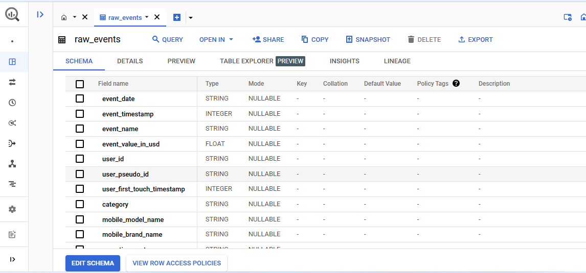
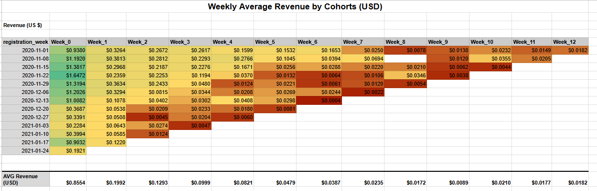
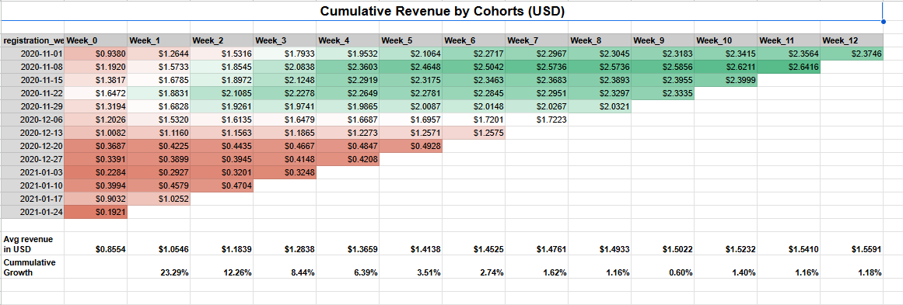

# Customer Lifetime Value Analysis

# Problem Statement:
I assume to be a data analyst working in an e-commerce shop. This e-commerce shop is quite new and previously relied on 3rd party tools to analyze user behavior. 

As it grew, this was not enough and they need me to help them understand business better. Particularly they are interested if their marketing spending is justifiable. They know that it costs them **2 US$** on average to acquire a new customer on their website.

# E-Commerce Dataset:
The available data is a single parsed events table which contains various frontend actions done on the E-Commerce website. Table is called `raw_events` and columns description are available in the table details section. 

The database is in BigQuery and my queries are written in bigquery.

Data in the table contains records from 2020-11-01 until 2021-01-31.

# Main Task:
My manager has read on Shopify blog that one can calculate Customer Lifetime Value (CLV). He did not get all the details or how to actually calculate and asked my help to do it. He needs the following information:
* Calculate Average Order Value (AOV) for full dataset
* Calculate Purchase Frequency (PF) of all your customers
* Customer Value (CV)
* Estimate Customer Lifetime Value (CLV) assuming a customer Lifespan of 3 years

# My Thought Process:
You looked at the raw data and decided to use `user_pseudo_id` to distinguish between different customers and use `event_name = ‘purchase’` to filter for events when customers purchased something. I also needed to identify the correct column in the table which represents the purchase amount in monetary units.
The task to get the Customer Lifetime Value would be in stages:
1. I wrote queries to create **Average Weekly Revenue by Cohort**,
2. Then, I calculated Cumulative revenue by Cohort.
3. And lastly, revenue predictions for same Cohorts for the next 12 weeks.

* **_[Here](ClvQueries.sql) is my query to get the weekly average revenue by cohort._**
* **_[Googlesheet CLV](https://docs.google.com/spreadsheets/d/1gJ4HS8z3sdNAtHL8-GleoRmNuKeb0-zl3OiOAmKf3Cs/edit?gid=502478635#gid=502478635) has the cohort charts._**

## Weekly Average Revenue:

### Insights:									
**Decreasing Revenue Over Time:**						
1. There is a noticeable trend where the weekly average revenue decreases as we move from Week 0 to subsequent weeks. 
2. This suggests that user engagement and spending tend to decline over time after users register. 
3. Efforts to retain user interest or re-engage them might be necessary to sustain revenue."									
									
**Higher Initial Revenue in Earlier Cohorts:**									
Earlier cohorts (e.g., November 2020 registrations) show higher initial revenue compared to later cohorts (e.g., January 2021 registrations). 
This might indicate changes in user acquisition quality, marketing efforts, or seasonal effects influencing user behavior.						

## Cumulative Revenue by Cohorts (USD):

## Revenue Prediction by Cohorts (USD):

### Insights:																								
**Relevance of the "All Weekly Cohort Average:**															
1. The $1.47 average serves as a benchmark for evaluating the relative performance of each cohort. 
2. Cohorts exceeding this average are considered more successful in generating revenue, while those falling below it may indicate opportunities for improvement in retention strategies or customer engagement.						
															
**Cohorts Above Average:**															
1. The cohorts starting on Nov 8, Nov 15, and Nov 22 exceed this average significantly, with Week 12 CLV predictions of $2.67, $2.46, and $2.37, respectively. 
2. This indicates that these cohorts are performing much better in terms of cumulative revenue and customer lifetime value.												
															
**Cohorts Below Average:**														
1. The January 2021 cohorts, for instance, have Week 12 predictions that are well below the $1.47 average. 
2. The lowest among them is $0.35, suggesting weaker performance for customers acquired during that time frame.

## Recommendations Based on CLV Predictions:											
											
1. **Invest More in High-Performing Cohorts (Nov - Dec 2020):**											
  The cohorts from Nov 8, Nov 15, and Nov 22, 2020, show high predicted CLV values (above $2.30). 
  It indicates that customers acquired during this period are more valuable."											
**Recommendation:** Increase marketing spend on channels or strategies used during these weeks, as they seem to attract higher-value customers. 
                     Analyze what might have contributed to the higher CLV (e.g., promotions, marketing messages, or seasonal factors) and replicate similar strategies."											
											
2. **Segment Customers Based on CLV Predictions:**																					
  Group customers into different segments based on their predicted CLV (e.g., high, medium, low).											
  **Recommendation:** Allocate resources differently for each segment. 
                      For high-CLV customers, invest in premium customer support or exclusive offers. 
                      For low-CLV customers, focus on upselling or cross-selling to improve their value."											
											
											
									

